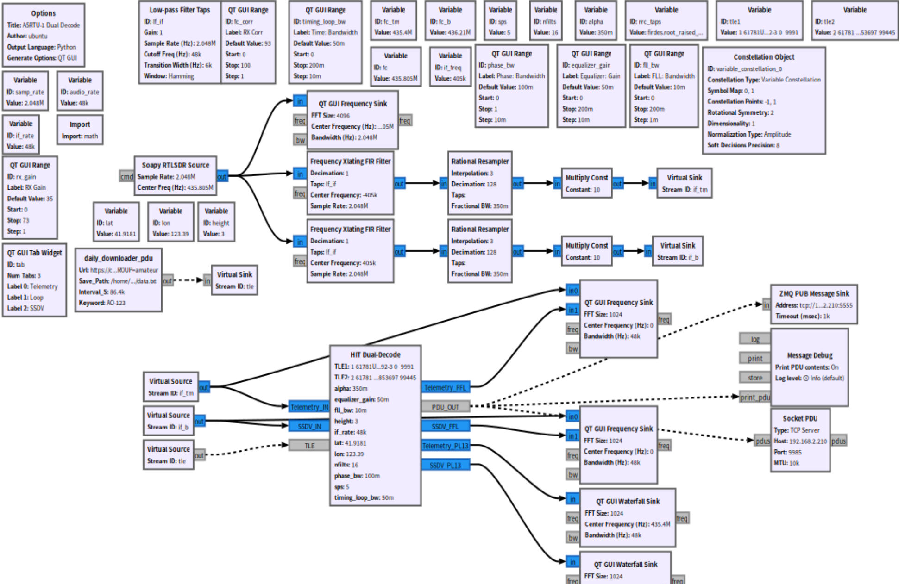
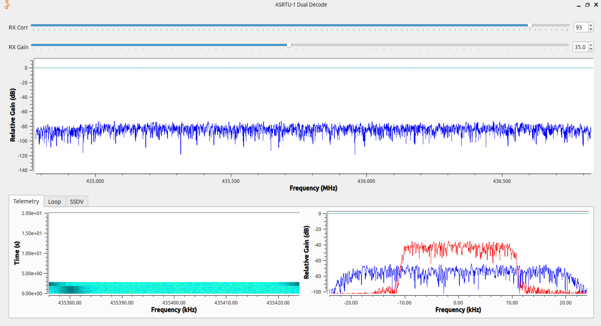
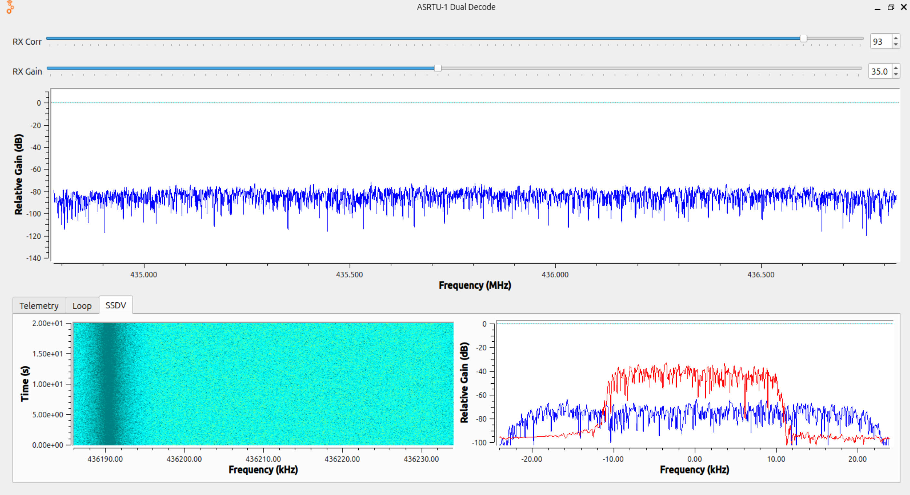
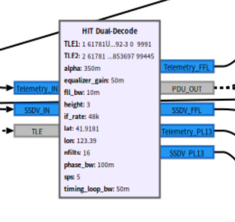
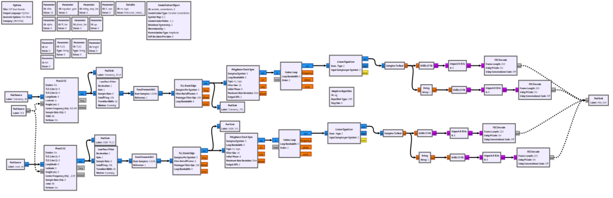

上节成功安装了哈工大提供的两个库的3.10版本，本节将利用已经安装的库实现ASRTU-1卫星遥测接收的双路解码流图

## 哈工大提供的原始流图

由于该流图的部分块在3.10已经废弃不可用，而且同时只可以选择接收遥测或者SSDV而不能同时接受两个信号，故我有了将两个频点的信号接收做在同一个流图中，这样子就可以从RTL的频带内同时获取SSDV和遥测的数据包

## 修改后的流图

图中通过RTL Source接出两条重采样线路分别输入块中，在变量中修改实际的经纬度以及高度信息，使用FWT提供流图中的自动更新星历传入，运行后可以看到频谱图、频谱瀑布图以及参数设置栏

流图中的Dual-Decode块使用了自定义Hier块，将复杂的解码过程简化为一个块的输入输出，使得流图更加简洁

Dual-Decode块的流图如下

结构为两路解码数据，最终全部送入pad sink，最后在流图中接入PDU块从而输入到解码软件中