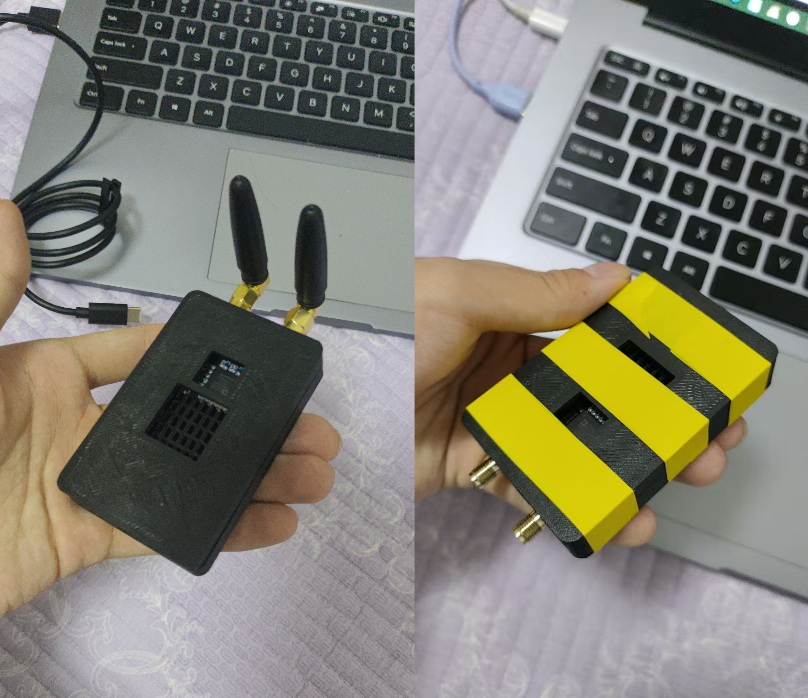
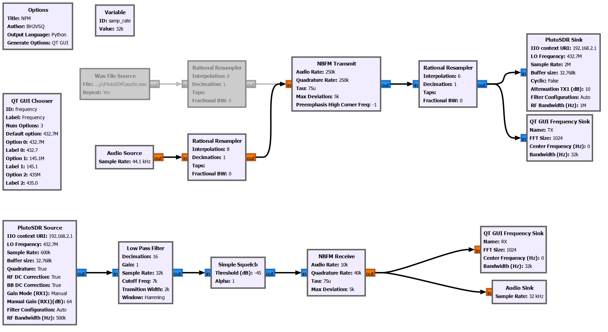

最近搞了一台PlutoSDR，算上运费也就只有270块钱，相较于市面上动辄上千的进口版Pluto和动辄上万的USRP，可谓是性价比极高，非常适合软件定义无线电的学习

先暂时画了一个3D打印的外壳装起来，等过两天在嘉立创CNC做的铝壳到了再换上

## WFM Transmitter
WFM流图如下：

流图中实现了：
1.可调频率发射，通过修改QT GUI Chooser的选项修改预设频率
2.可控输入音频，既可以输入WAV文件，也可以通过Audio Sink输入麦克风音频实时发送
3.回流解码：通过Pluto的RX端口接入将信号重新解码为音频通过扬声器外放出来
## NFM Transmitter
NFM流图如下：

流图中功能与WFM调制基本一致，只是将WFM模式的Transmitter模块和Receive模块更换为了NFM模式的Transmitter模块和Receive模块,接收处原先的重采样模块更换为了低通滤波器并串联一个静噪模块
## 仍未解决的问题
音频数据没有改变，模式改变后，发射部分流块中的输入重采样功能块插值设置不同，WFM模式插值设置为12时可以保证输出音频不失真，但NFM模式该设置值为8时不失真
