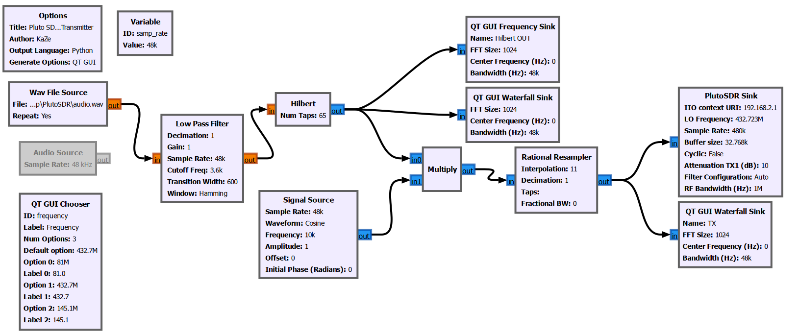
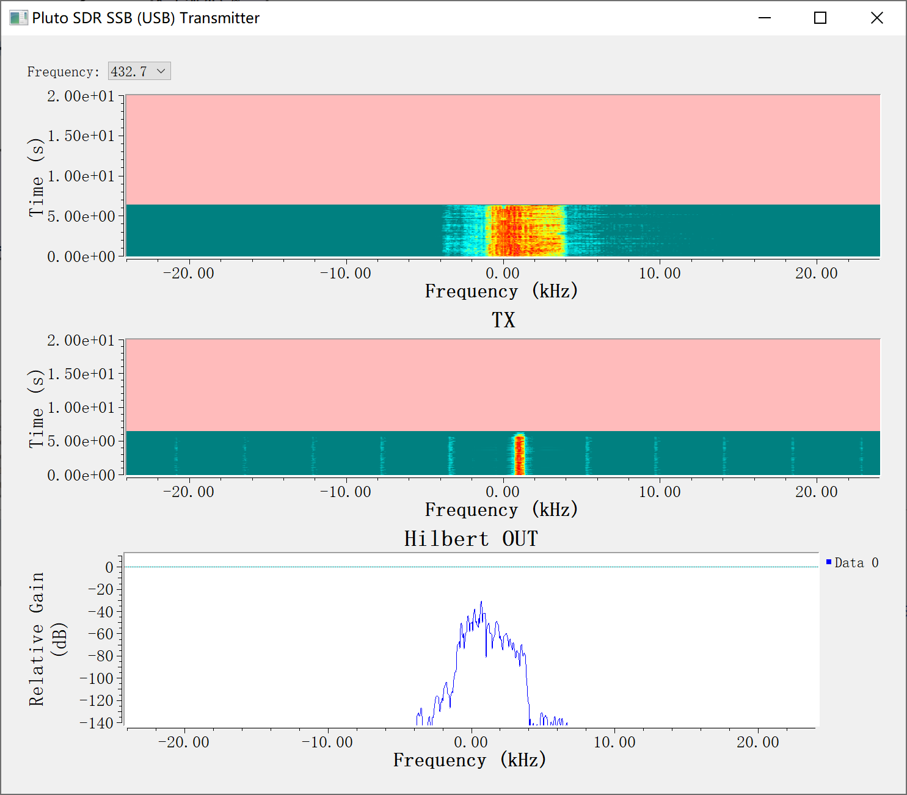
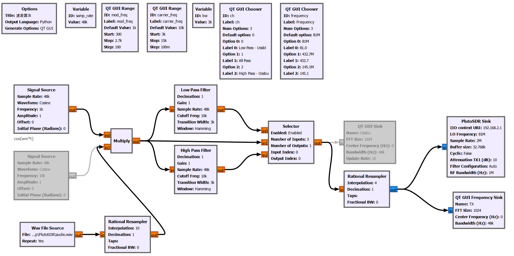

书接上文，这一节使用PlutoSDR配合GNURadio实现SSB模式的调制与解调

## 官方SSB-Demo
通过GNURadio wiki下载的Demo流图可以实现USB LSB模式的调制切换

### 目前存在问题
1.当使用流块内Virtual Sink和Source传递信号时可以正常调制解调，但是当连接PlutoSDR Sink和Source发射接收时存在跳音不连续问题

2.当使用PlutoSDR发射时使用SDR接收只能接收到失真的信号，无法辨别任何语音信号
## 其他方案
### 流图1

此流图可以调制出USB模式的信号输出，但是存在严重的不固定频率偏移

初次运行计算频差偏移为33kHz，在流块中添加频移offset之后运行计算频差又变为了23kHz，调节后又存在800Hz的频率偏差，纠正800Hz后又偏移过多，保持800Hz频差在800Hz偏移处接收，部分时间可以解调为未失真音频，等待一段时间后再次出现小幅度偏移
### 流图2，3
流图2 流图3均为在B站上教学视频的示例流图，流图2为滤波器法调制SSB，流图3为希尔伯特变换法调制SSB
#### 流图2

#### 流图3

##### 存在问题
流图2，3调制出的频谱显示均为DSB模式，但使用SDR接收时需要使用AM模式才可以正常解调出音频，DSB模式，SSB模式均无法解调出音频
