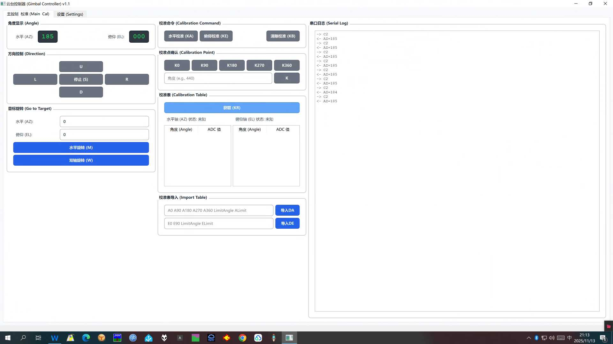
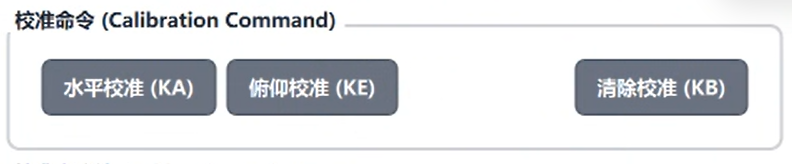
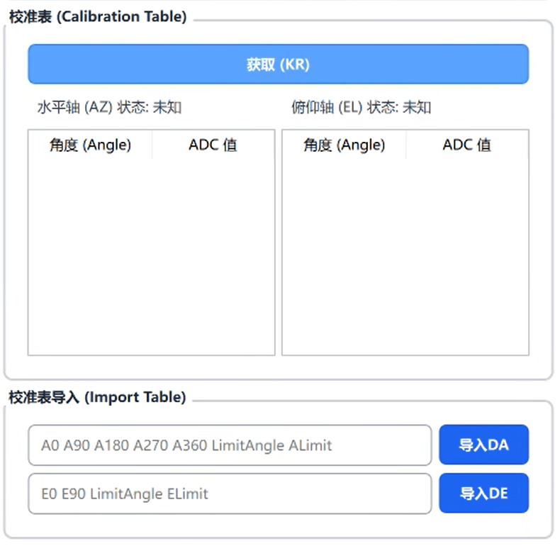

## 上位机界面

首先将控制盒连接至电脑，打开上位机软件，默认打开时应该位于串口端口选择界面，在这个界面选择控制盒对应的端口，波特率9600，点击连接

进入主界面，包含角度显示，串口日志，校准，以及目标旋转功能块

## 旋转器校准

将控制盒通过连接线连接至旋转器控制器，如果是G1000或者G800，只需要进行水平校准，如果是G5500则需要额外进行俯仰校准

点击校准后，右侧日志窗口应该会弹出提示**校准开始：请转到 0°，然后发送 K0 确认**,此时将旋转器转至0°(需要在安装旋转器时，将旋转器0°置于正北方)，点击下方校准点确认中的K0按钮，此时应该提示进行到90°点的校准，依次类推，当360°点校准完成后，需要根据自己实际的旋转器的限位角度进行旋转，建议旋转角度略小于限位角度，比如说限位角度为432，则建议旋转至425左右作为记录点，然后将实际角度输入到校准点确认部分的输入框，点击K，则确定限位校准点角度以及相关电压回传记录校准点，若使用的是G5500，在校准俯仰角度时最后的180°点也是如此操作
**此处建议调节旋转器控制器回传电压范围尽可能大一些，出厂默认应该是2-4.5V，根据说明书指示，最多可调节至近乎0-4.5V，此电压范围越大，实际插值计算实际角度时越精确

## 校准表功能

通过点击”获取(KR)“按钮，可以获取到当前控制盒的校准状态以及各个校准点的角度和电压ADC采样值，用于参数备份
当参数丢失时，可以通过下方的校准表导入历史的校准数据
水平轴格式为
DA (0°校准表值) (90°校准表值) (180°校准表值) (270°校准表值) (360°校准表值) (450°位限位角角度) (限位角校准表值)
例如：DA 12 191 385 575 746 420 870 (其中420表明限位角校准点为420°即实际方位角的60°)
俯仰轴格式为
DE (0°校准表值) (90°校准表值) (180°位限位角角度) (限位角校准表值);
例如：DE 0 512 175 1023 (其中175表明限位角校准点为175°)

