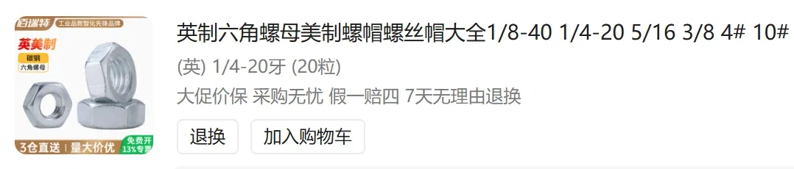
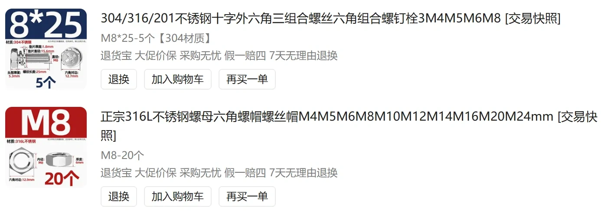
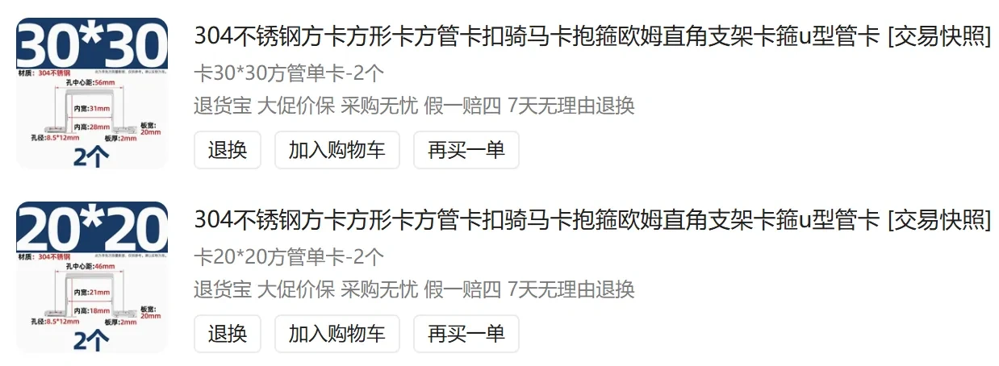
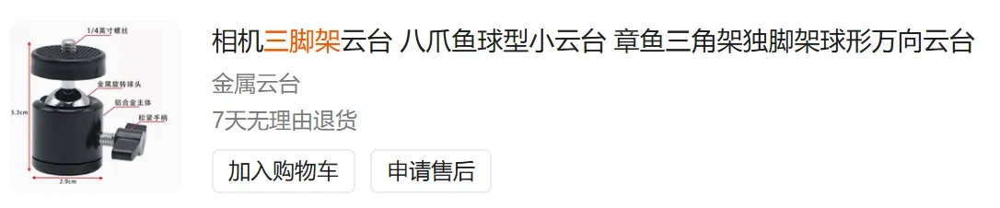
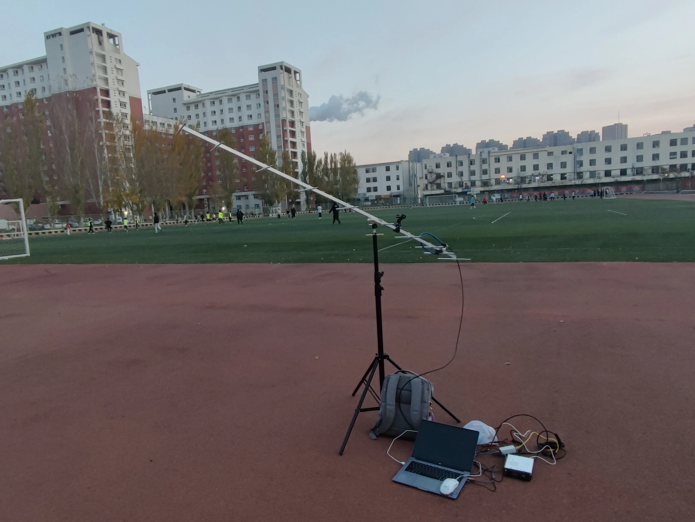
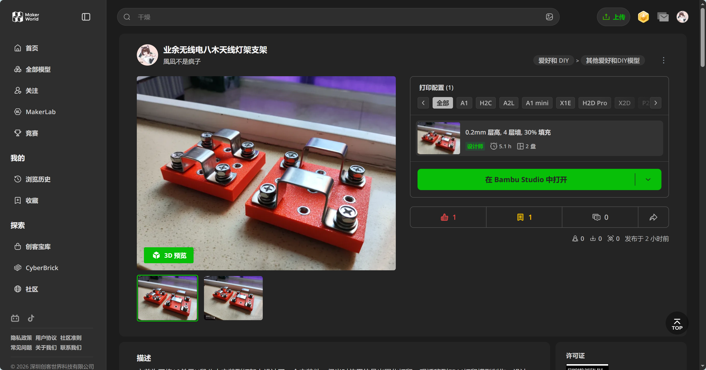

之前为了将10单元U段八木安装到灯架上设计了一个安装件，但当时使用的是光固化打印，现迁移到FDM打印模型制作

设计使用骑马卡配合螺丝螺母固定八木，使用1/4英寸螺母配合一个万向球头安装到灯架上，也可以自行根据需要下载solidworks文件根据尺寸设计一个更紧固的安装配件

打印件除了中心的万向球头安装位以外还有四个安装位预留使用，打印件上有三角形箭头，箭头指向的方向即为主梁的安装方向

五金配件列表如下

螺母固定使用的是过盈配合，单凭手部力量可能难以安装，可以使用一颗M8螺丝拧在M8螺母上配合锤子敲击将螺母敲进安装位置，螺母表面与打印件表面齐平即可，1/4英寸螺母可以使用M8螺丝配合M8螺母制作一个垫块进行敲击安装

**注意！不建议固定架设使用，仅可野架等临时架设时使用**

以下为实际架设使用此连接件架设八木天线进行GreenCube卫星通联的记录画面

模型已上传至[MakerWorld平台](https://makerworld.com.cn/zh/models/2600122-ye-yu-wu-xian-dian-ba-mu-tian-xian-deng-jia-zhi-ji)

