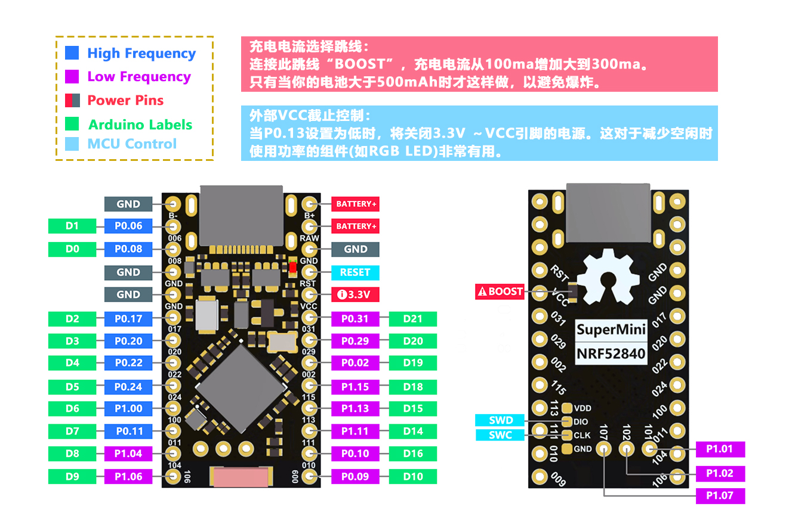

本文介绍如何使用 ST-Link V2 和 OpenOCD 对 Nice!Nano nRF52840 进行固件备份、烧录与恢复，并配置 Wireshark 的 nRF Sniffer for Bluetooth LE 扩展接口。

### 一、硬件与软件准备

#### 1. Nice!Nano nRF52840



Nice!Nano 采用 Nordic nRF52840 芯片，主要参数如下：

| 项目 | 参数 |
|---|---|
| MCU | Nordic nRF52840 |
| CPU | ARM Cortex-M4 |
| Flash | 1 MiB |
| RAM | 256 KiB |
| Bootloader | UF2 Bootloader 0.11.0 |
| SoftDevice | S140 6.1.1 |


#### 2. 调试器与软件

- **调试器：** ST-Link V2
- **烧录工具：** OpenOCD 0.12.0
- **操作系统：** Windows
- **编程环境：** Python 3
- **sdk包：** Nordic nRF Sniffer for Bluetooth LE 4.1.0

本文使用的 OpenOCD 路径示例：

```text
D:\msys64\mingw64\bin\openocd.exe
```

### 二、ST-Link V2 接线

将 ST-Link V2 连接至 Nice!Nano 的 SWD 接口。

| ST-Link V2 | Nice!Nano |
|---|---|
| SWDIO | SWDIO |
| SWCLK | SWCLK |
| GND | GND |
| 3.3V / VTref | 3.3V |

连接时确保两块板共地，并使用目标板的 3.3V 作为电压参考。操作前检查目标电压是否正常。

### 三、检查芯片连接

正式备份或烧录之前，先确认 OpenOCD 可以正常识别 nRF52840。

```cmd
D:\msys64\mingw64\bin\openocd.exe ^
  -f interface/stlink.cfg ^
  -f target/nrf52.cfg ^
  -c "adapter speed 1000" ^
  -c "init" ^
  -c "reset halt" ^
  -c "shutdown"
```

如果无法识别目标芯片，应先检查接线、电源和调试器状态，暂时不要进行擦除或烧录操作。

### 四、备份原始固件

#### 1. 备份完整 Flash

nRF52840 的内部 Flash 容量为 1 MiB。建议备份完整 Flash，以保留应用程序、SoftDevice、MBR、UF2 Bootloader 及 Bootloader Settings 等内容。

```cmd
D:\msys64\mingw64\bin\openocd.exe ^
  -f interface/stlink.cfg ^
  -f target/nrf52.cfg ^
  -c "adapter speed 1000" ^
  -c "init" ^
  -c "reset halt" ^
  -c "dump_image nicenano_flash_1mb.bin 0x00000000 0x100000" ^
  -c "shutdown"
```

生成文件：

```text
nicenano_flash_1mb.bin
```

文件大小应为 1048576 bytes，即 1 MiB。

#### 2. 备份 UICR

UICR 是独立于普通 Flash 的用户配置区域。

```cmd
D:\msys64\mingw64\bin\openocd.exe ^
  -f interface/stlink.cfg ^
  -f target/nrf52.cfg ^
  -c "adapter speed 1000" ^
  -c "init" ^
  -c "reset halt" ^
  -c "dump_image nicenano_uicr.bin 0x10001000 0x1000" ^
  -c "shutdown"
```

生成文件 `nicenano_uicr.bin`，大小为 4096 bytes。

#### 3. 备份 FICR

FICR 是芯片出厂信息区域，建议保存为信息快照。

```cmd
D:\msys64\mingw64\bin\openocd.exe ^
  -f interface/stlink.cfg ^
  -f target/nrf52.cfg ^
  -c "adapter speed 1000" ^
  -c "init" ^
  -c "reset halt" ^
  -c "dump_image nicenano_ficr.bin 0x10000000 0x1000" ^
  -c "shutdown"
```

生成文件 `nicenano_ficr.bin`，大小为 4096 bytes。

#### 4. 保存备份与校验值

建议使用以下目录保存：

```text
NiceNano_Backup/
├── nicenano_flash_1mb.bin
├── nicenano_uicr.bin
├── nicenano_ficr.bin
└── SHA256.txt
```

使用 Windows 自带的 `certutil` 计算 SHA256：

```cmd
certutil -hashfile nicenano_flash_1mb.bin SHA256
certutil -hashfile nicenano_uicr.bin SHA256
certutil -hashfile nicenano_ficr.bin SHA256
```

将计算结果保存到 `SHA256.txt`，便于后续确认备份文件是否完整。

### 五、烧录 nRF Sniffer 4.1.0 固件

本文使用基于 Nordic PCA10059 / nRF52840 Dongle 版本的 nRF Sniffer 4.1.0 固件，并针对 Nice!Nano 的电源架构进行了 LDO 兼容性修改。

该固件属于修改后的实验性版本，并非 Nordic 官方为 Nice!Nano 提供的专用固件。

假设固件文件位于：

```text
D:\Code-Project\nrf-sniffer\sniffer_nicenano_4.1.0.hex
```

使用 OpenOCD 烧录：

```cmd
D:\msys64\mingw64\bin\openocd.exe ^
  -f interface/stlink.cfg ^
  -f target/nrf52.cfg ^
  -c "adapter speed 1000" ^
  -c "init" ^
  -c "reset halt" ^
  -c "flash write_image erase D:/Code-Project/nrf-sniffer/sniffer_nicenano_4.1.0.hex" ^
  -c "verify_image D:/Code-Project/nrf-sniffer/sniffer_nicenano_4.1.0.hex" ^
  -c "reset run" ^
  -c "shutdown"
```

烧录完成后，通过 `verify_image` 检查固件内容是否与目标存储器一致。

### 六、Wireshark 配置 nRF Sniffer

#### 1. 准备 extcap 文件

nRF Sniffer for Bluetooth LE 4.1.0 的扩展接口文件位于 Sniffer 软件目录的 `extcap` 文件夹中。

主要文件包括：

```text
nrf_sniffer_for_bluetooth_le_4.1.0/
└── extcap/
    ├── nrf_sniffer_ble.bat
    ├── nrf_sniffer_ble.py
    ├── nrf_sniffer_ble.sh
    ├── requirements.txt
    └── SnifferAPI/
```

其中，`nrf_sniffer_ble.py` 是 Sniffer 的主要接口程序，`nrf_sniffer_ble.bat` 用于 Windows 环境下启动该接口。

#### 2. 复制至 Wireshark 的 extcap 目录

假设 Wireshark 安装目录为：

```text
D:\Program Files\Wireshark
```

将以下文件复制到 Wireshark 的 `extcap` 目录：

```text
nrf_sniffer_ble.bat
nrf_sniffer_ble.py
SnifferAPI\
```

目标目录：

```text
D:\Program Files\Wireshark\extcap\
```

完成后，Wireshark 即可通过 extcap 机制加载 nRF Sniffer 接口。

#### 3. 检查 extcap 接口

打开命令提示符，进入 extcap 目录，或直接使用完整路径执行：

```cmd
python310 nrf_sniffer_ble.py --extcap-interfaces
```

也可以执行：

```cmd
"D:\Program Files\Wireshark\extcap\nrf_sniffer_ble.bat" --extcap-interfaces
```

正常情况下，接口程序会输出类似以下内容：

```text
extcap {version=4.1.0}{display=nRF Sniffer for Bluetooth LE}
```

如果设备已经正确连接并被接口程序识别，还可以看到对应的设备接口，例如：

```text
interface {value=COM44-None}{display=nRF Sniffer for Bluetooth LE COM44}
```

其中 `COM44` 为示例串口号，实际使用时应以系统识别到的串口为准。

#### 4. 在 Wireshark 中选择 Sniffer 接口

完成 extcap 文件配置后：

1. 启动 Wireshark。
2. 打开捕获接口选择页面。
3. 找到 `nRF Sniffer for Bluetooth LE` 接口。
4. 选择对应的 Nice!Nano 串口设备。
5. 按照需要配置捕获参数并启动。

如果 Wireshark 中没有显示 nRF Sniffer 接口，可以重新检查 extcap 文件位置、Python 环境以及 Sniffer 依赖是否完整。

### 七、使用完整 Flash 备份恢复固件

当需要恢复 Nice!Nano 原始固件时，优先使用此前保存的完整 Flash 镜像：

```text
nicenano_flash_1mb.bin
```

假设备份文件位于：

```text
D:\Code-Project\nrf-sniffer\nicenano_flash_1mb.bin
```

执行恢复：

```cmd
D:\msys64\mingw64\bin\openocd.exe ^
  -f interface/stlink.cfg ^
  -f target/nrf52.cfg ^
  -c "adapter speed 1000" ^
  -c "init" ^
  -c "reset halt" ^
  -c "flash write_image erase D:/Code-Project/nrf-sniffer/nicenano_flash_1mb.bin 0x00000000 bin" ^
  -c "verify_image D:/Code-Project/nrf-sniffer/nicenano_flash_1mb.bin 0x00000000 bin" ^
  -c "reset run" ^
  -c "shutdown"
```

恢复流程：

```text
擦除
  ↓
写入完整 Flash 镜像
  ↓
验证
  ↓
复位运行
```

恢复完成后，可以断开 ST-Link，重新连接 Nice!Nano 的 USB，检查设备是否正常枚举。

### 八、UICR 与 FICR 的注意事项

#### UICR

UICR 存储用户配置，例如 APPROTECT、PSELRESET 和 NFCPINS 等。

如果烧录过程中没有修改 UICR，通常无需额外恢复 UICR。涉及启动和保护配置时，应谨慎操作。

#### FICR

FICR 属于芯片工厂信息区域，包含设备自身的识别信息及硬件参数。

`nicenano_ficr.bin` 用于保存芯片信息，不应将其作为普通固件镜像写回芯片。

### 九、常见注意事项

1. 先备份，再烧录。任何可能改变启动链或固件的操作，都应先保存完整 Flash 镜像。
2. 不要只备份应用程序。单独的应用 HEX 可能不包含 MBR、SoftDevice 和 Bootloader 等区域。
3. 不要随意执行 `mass_erase` 或 `nrf52_recover`。排查问题时，应优先考虑使用已有备份恢复。
4. 注意 `flash write_image erase` 的影响。擦除操作以 Flash sector 为单位，可能影响镜像范围之外但位于同一 sector 的数据。
5. 恢复后必须执行验证。写入完成后使用 `verify_image` 检查数据一致性。
6. 分别保存 Flash、UICR 和 FICR 备份。三者用途不同，不应混为一谈。

### 参考资料

- [OpenOCD Flash Commands](https://openocd.org/doc/html/Flash-Commands.html)
- [OpenOCD Flash Programming](https://openocd.org/doc/html/Flash-Programming.html)
- [Nordic nRF52840 Product Specification](https://docs.nordicsemi.com/r/bundle/ps_nrf52840/)
- [Nordic nRF Sniffer for Bluetooth LE](https://www.nordicsemi.com/Products/Development-tools/nRF-Sniffer-for-Bluetooth-LE)